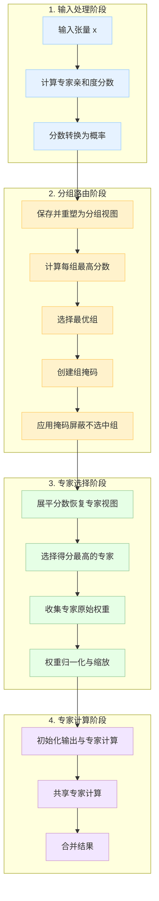

# 混合专家模型(MoE)路由机制详细流程

## 整体流程图 (Mermaid)

```mermaid
flowchart TD
    classDef inputStage fill:#e6f2ff,stroke:#99ccff
    classDef groupStage fill:#fff2cc,stroke:#ffcc66
    classDef selectStage fill:#e6ffe6,stroke:#99cc99
    classDef computeStage fill:#f2e6ff,stroke:#cc99cc

    A[输入张量 x] --> B[计算专家亲和度分数]
    B --> C[分数转换为概率]
    C --> D[保存并重塑为分组视图]
    D --> E[计算每组最高分数]
    E --> F[选择最优组]
    F --> G[创建组掩码]
    G --> H[应用掩码屏蔽不选中组]
    H --> I[展平分数恢复专家视图]
    I --> J[选择得分最高的专家]
    J --> K[收集专家原始权重]
    K --> L[权重归一化与缩放]
    L --> M[初始化输出与专家计算]
    M --> N[共享专家计算]
    N --> O[合并结果]

    subgraph "1. 输入处理阶段"
        A
        B
        C
    end
    subgraph "2. 分组路由阶段"
        D
        E
        F
        G
        H
    end
    subgraph "3. 专家选择阶段"
        I
        J
        K
        L
    end
    subgraph "4. 专家计算阶段"
        M
        N
        O
    end

    class A,B,C inputStage
    class D,E,F,G,H groupStage
    class I,J,K,L selectStage
    class M,N,O computeStage
```
