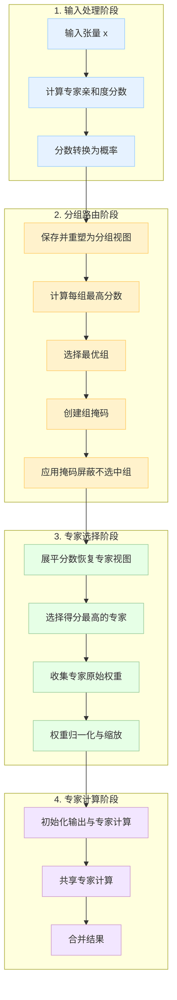

# 混合专家模型(MoE)路由机制详细流程

**参数设置:** dim=16, n_experts=32, n_groups=8, topk_groups=2, topk=2

## 整体流程图 (Mermaid)



## 详细步骤说明

### 1️⃣ 输入处理阶段

| 步骤 | 操作 | 代码 | 张量变化 |
|------|------|------|----------|
| **1** | **输入张量** | 输入向量 `x` | [2, 1, 16]<br>*例:* `[[1.1, -0.2, 0.3, ...], [0.2, 0.3, -0.4, ...]]` |
| **2** | **计算专家分数** | `scores = Linear(x, self.weight)` | [2, 32]<br>*将输入映射到每个专家的得分* |
| **3** | **分数转换** | `scores = scores.softmax(dim=-1)` 或<br>`scores.sigmoid()` | [2, 32]<br>*将专家分数转换为概率分布，每行和为1* |

### 2️⃣ 分组路由阶段

| 步骤 | 操作 | 代码 | 张量变化 |
|------|------|------|----------|
| **4** | **保存原始分数并重塑** | `original_scores = scores`<br>`scores = scores.view(batch, n_groups, -1)` | [2, 8, 4]<br>*8组，每组4个专家* |
| **5** | **计算组代表分数** | `group_scores = scores.amax(dim=-1)` | [2, 8]<br>*每组取最高分专家作为组分数* |
| **6** | **选择最优组** | `indices = group_scores.topk(topk_groups, dim=-1)[1]` | [2, 2]<br>*每个样本选择得分最高的2个组* |
| **7** | **创建组掩码** | `mask = scores.new_ones(...).scatter_(1, indices, False)` | [2, 8]<br>*布尔掩码，False表示要保留的组* |
| **8** | **应用掩码** | `scores.masked_fill_(mask.unsqueeze(-1), float('-inf'))` | [2, 8, 4] → [2, 8, 4]<br>*未选中组的分数设为-∞* |

**组掩码示例:**
```python
[
  [False, True],  # 样本1: 保留组0，排除组1
  [True, False]   # 样本2: 排除组0，保留组1
]
```

**掩码后的分数:**
```python
[
  [[0.18, 0.16, 0.19, 0.11],  # 样本1，组0保留
   [-inf, -inf, -inf, -inf]],  # 样本1，组1排除
  [[-inf, -inf, -inf, -inf],  # 样本2，组0排除
   [0.17, 0.18, 0.12, 0.10]]   # 样本2，组1保留
]
```

### 3️⃣ 专家选择阶段

| 步骤 | 操作 | 代码 | 张量变化 |
|------|------|------|----------|
| **9** | **展平专家分数** | `scores = scores.flatten(1)` | [2, 32]<br>*但只有8个(2×4)有效分数* |
| **10** | **选择最终专家** | `indices = torch.topk(scores, topk, dim=-1)[1]` | [2, 2]<br>*每个样本选择2个最高分专家* |
| **11** | **获取专家权重** | `weights = original_scores.gather(1, indices)` | [2, 2]<br>*收集选中专家的原始概率分数* |
| **12** | **归一化与缩放** | `weights /= weights.sum(dim=-1, keepdim=True)`<br>`weights *= route_scale` | [2, 2]<br>*调整专家的影响力* |

**选择的专家索引:**
```python
[
  [2, 0],  # 样本1选择专家2和专家0
  [4, 3]   # 样本2选择专家4和专家3
]
```

### 4️⃣ 专家计算阶段

| 步骤 | 操作 | 代码 | 张量变化 |
|------|------|------|----------|
| **13** | **初始化输出** | `y = torch.zeros_like(x)` | [2, 1, 16]<br>*创建与输入相同形状的输出张量* |
| **14** | **专家计算循环** | `for i in range(experts_start_idx, experts_end_idx):`<br>&nbsp;&nbsp;`idx, top = torch.where(indices == i)`<br>&nbsp;&nbsp;`y[idx] += expert(x[idx]) * weights[idx, top, None]` | 累加各专家的加权输出 |
| **15** | **共享专家计算** | `z = shared_experts(x)` | [2, 1, 16]<br>*所有样本都通过的共享专家* |
| **16** | **合并结果** | `return (y + z).view(shape)` | [2, 1, 16]<br>*最终输出* |

**专家计算示例:**
```python
# 样本1的专家2处理
y[0] += expert2(x[0]) * 0.19

# 样本1的专家0处理
y[0] += expert0(x[0]) * 0.18
```

## 关键张量变化可视化

### 分组过程示意图
```
scores [2, 32] → view → scores [2, 8, 4]
     ┌───────────────────┐
     │  e0  e1  e2  e3   │  组0
     │  e4  e5  e6  e7   │  组1
     │  e8  e9  e10 e11  │  组2
     │  e12 e13 e14 e15  │  ...
样本1 │  e16 e17 e18 e19  │
     │  e20 e21 e22 e23  │
     │  e24 e25 e26 e27  │
     │  e28 e29 e30 e31  │  组7
     └───────────────────┘
```

### 两级路由过程

1. **第一级路由**：选择组
   ```
   样本1选择组 → [组2, 组6]
   样本2选择组 → [组5, 组1]
   ```

2. **第二级路由**：在选中的组内选择专家
   ```
   样本1从 [e8,e9,e10,e11,e24,e25,e26,e27] 中选择 → [e10, e8]
   样本2从 [e4,e5,e6,e7,e20,e21,e22,e23] 中选择 → [e22, e5]
   ```

## 关键函数解释

| 函数 | 作用 | 在MoE中的角色 |
|------|------|--------------|
| `torch.amax(dim=-1)` | 沿指定维度取最大值 | 计算每组内的最高分数作为组得分 |
| `torch.topk(k, dim=-1)` | 选择前k个最大值和索引 | 选择最高分的组和专家 |
| `tensor.scatter_(dim, index, value)` | 按索引更新张量的值 | 创建表示选中组的掩码 |
| `masked_fill_(mask, value)` | 将满足条件的位置填充为指定值 | 将未选中组的专家得分设为负无穷 |
| `tensor.flatten(start_dim, end_dim)` | 将指定维度范围内的维度展平 | 将分组视图重新展平为专家列表 |
| `tensor.gather(dim, index)` | 沿指定维度收集索引对应的值 | 收集选中专家的原始权重 |

## 算法核心思想

> 💡 **两级路由机制**
> 
> 首先选择专家组，然后在选中的组内选择具体专家，这种两级筛选大大减少了计算复杂度。
> 当有大量专家时，直接从所有专家中选择top-k需要计算和比较所有专家分数，而两级路由可将计算复杂度从O(n_experts)降低到O(n_groups + experts_per_group)。

> 💡 **专家贡献加权组合**
> 
> 每个输入可能被路由到多个专家，最终输出是这些专家输出的加权组合，权重来自原始路由分数，确保最匹配的专家有更大贡献。

## 为何使用Softmax和Sigmoid

- **Softmax**: 将所有专家的得分转换为概率分布，总和为1，强调专家之间的竞争关系
- **Sigmoid**: 每个专家独立激活，适用于多个专家可能同样适合处理输入的情况，需要额外归一化

---

*参数说明: dim=16表示特征维度，32个专家分为8组，每组4个专家，每个输入激活2个组和2个专家*
