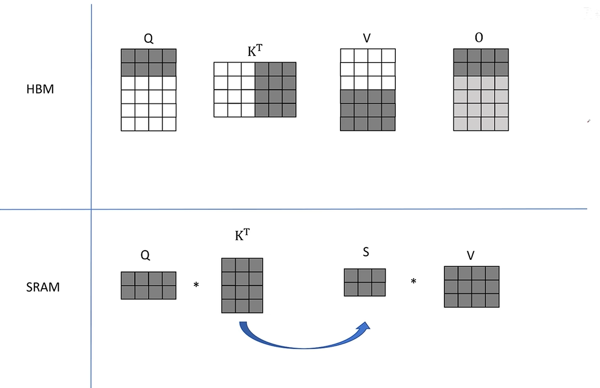
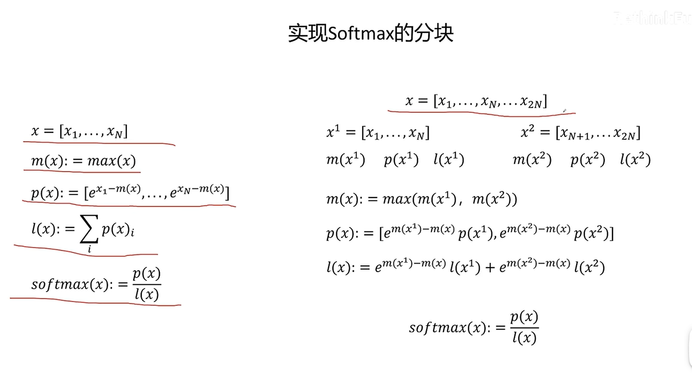

flash attention主要通过改善I/O来加速模型推理。

普通的attention 需要大量的HBM访问，因为每一次QK、Softmax和V的加权累加运算都需要从HBM中把需要的信息拿出来，然后再SRAM中运算，而HBM的访问是很耗时间的。

因此，flash attention目标是避免Attenion matrix从HBM的读写

1. 通过分块计算，融合多个操作，减少中间结果缓存
2. 反向传播时重新计算中间结果

具体操作为（暂不考虑softmax）：

For kj,vj in zip(K,V):

    拿进去SRAM
    For qi in Q:
        依次拿进去SRAM
        计算attni = Atten(qi,kj,vj)
        oi = Wo(attni)
        tmp_oj = concat(tmp_oj,oi)
    O+= tmp_oj

softmax的分块用了比较巧妙的数学上的方法

总的来说：
在标准自注意力（standard attention）中，每一次对 Q 与 K 的矩阵乘法、Softmax 归一化以及与 V 的加权求和，都会从 HBM 读取对应的 Q、K、V 矩阵块，并在完成后将输出及中间结果写回 HBM，导致每层每个头部的 HBM 访问复杂度为 O(N^2)。而FlashAttention 则将 Q,K,V 按块（tile）一次性从 HBM 加载到片上 SRAM，在 SRAM 内融合矩阵乘法、Mask、Softmax 及加权求和等操作，最后仅将输出块一次性写回 HBM，从而将 HBM 访问次数降至 O(N^2/B)（B 为块大小）。这种 IO-aware 的分块与操作融合策略，大幅降低了 HBM↔SRAM 通信瓶颈，带来显著的速度和内存效率提升。
