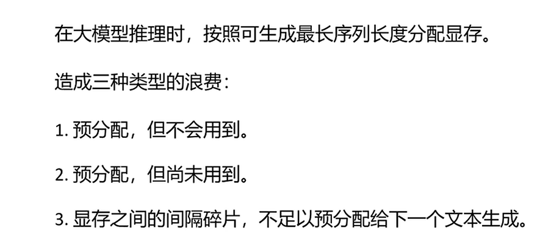
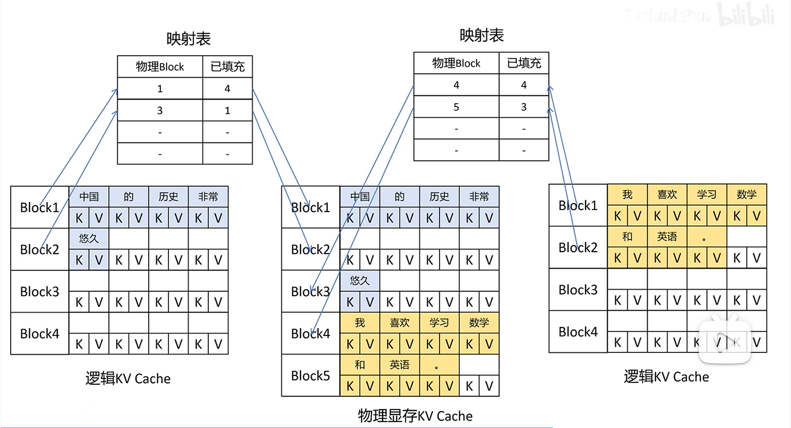

普通的kv cache的存法是，在一开始就预分配kv cache的连续显存空间，使得

1. 在生成结束后可能空间都没用完
2. 即使能用完，在生成刚开始时并不会占用多余的显存
3. 在当前实例生成结束后释放了显存空间，若下一个实例要占用的kv cache大于当前实例，不足以分配给下一个实例那么当前实例的显存空间就浪费了，变成间隔碎片。

paged attention主要是用在vllm里面的一个attention的改进版，他参考了操作系统页表的设计（在这里称为映射表）。他将kv cache拆分成固定大小的多个块，映射表中每一项对应一个块的逻辑地址到物理地址的映射，这样就无需将完整的 KV cache存储在连续物理显存中，显著减少了显存碎片，使得在显存受限的情况下也能支持更长的上下文或更大 batch 的推理。

