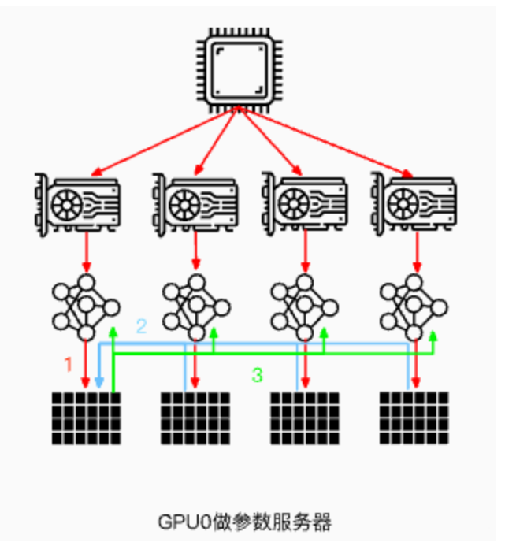
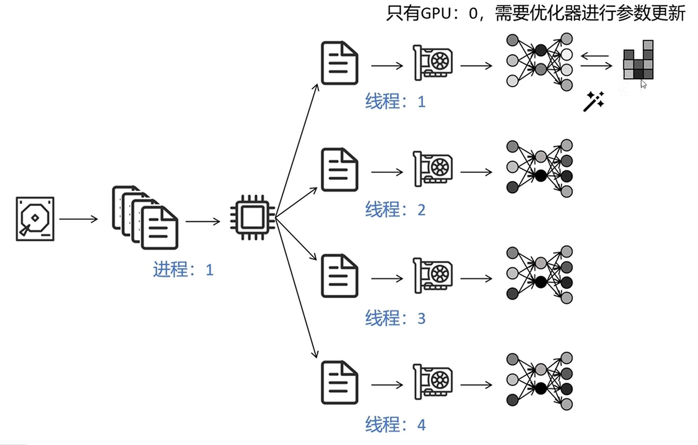
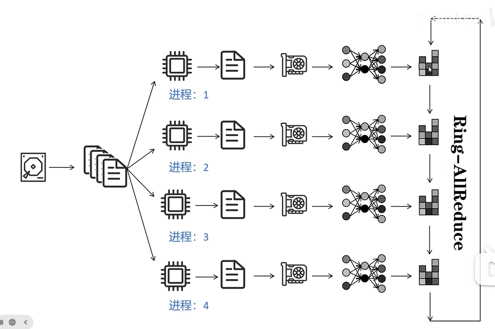
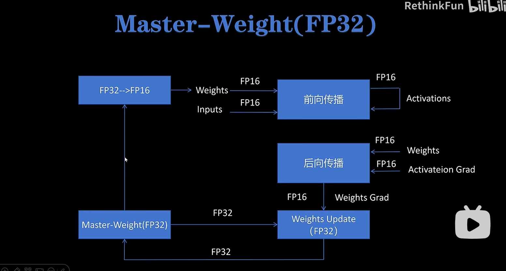
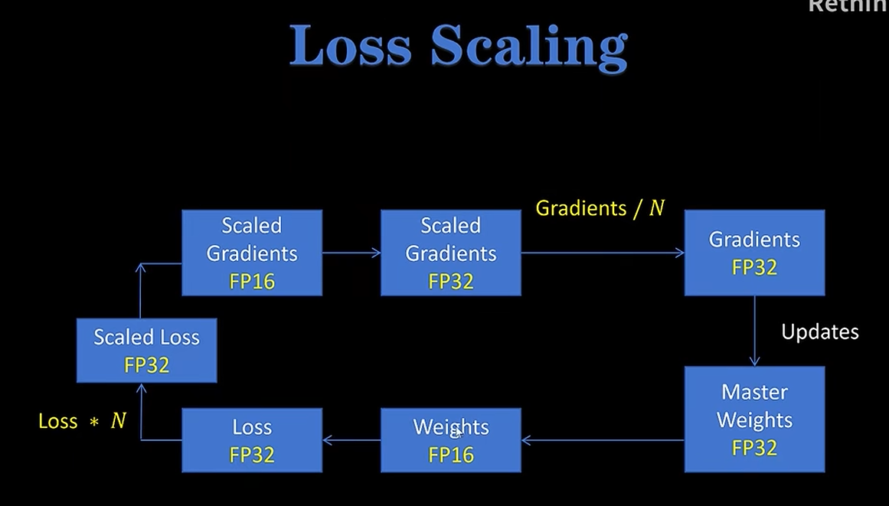
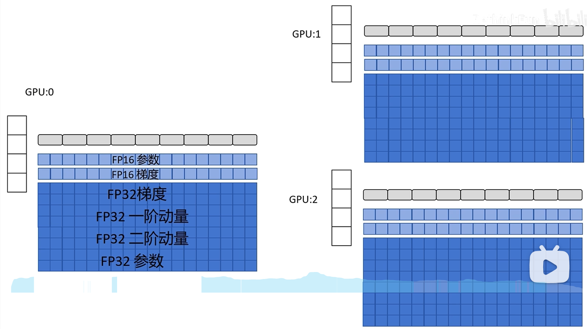
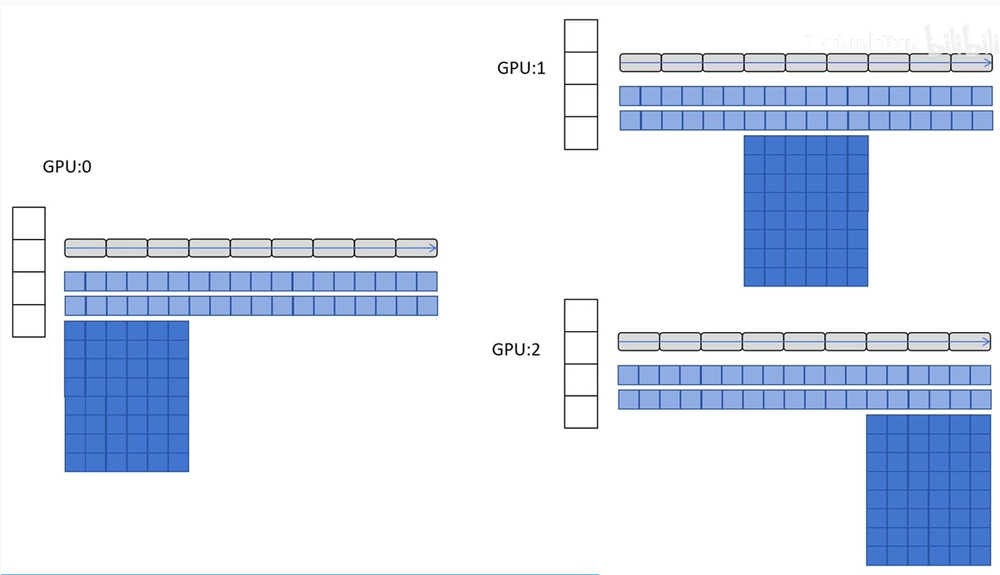
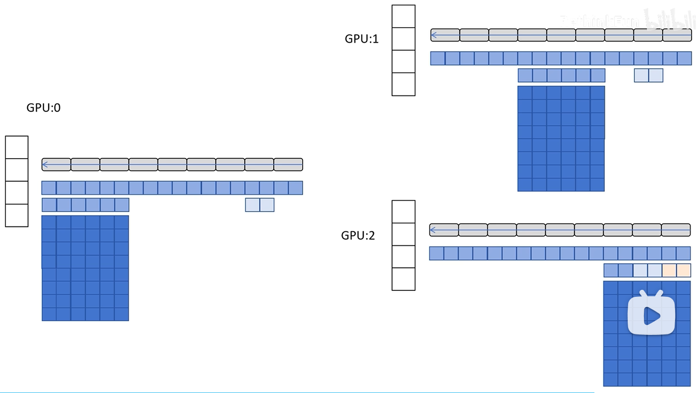
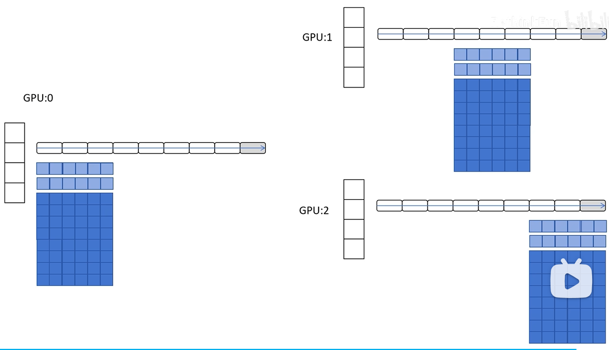

# 数据并行
切分数据，不切分模型。
## torch.nn.DataParallel (DP)
单进程多线程。master gpu将数据切分成n份，然后分发到每个gpu上，同时还将模型副本也分发到每个gpu上，各个gpu独自进行前向计算，计算完后将各自的梯度发回master gpu，master gpu（优化器只在这里）对模型进行梯度更新，然后再将更新完的模型副本同步到各个gpu上。
- 前向过程
1. 在主设备上将输入按 batch 维度切分；
2. 自动将切分后的子 batch 发送到各个 GPU 副本；
3. 每个副本各自执行前向计算。
- 反向过程
1. 各副本计算完梯度后，将梯度汇总（gather）并加总到主模型，再由主模型更新参数。
- 缺陷：
1. 不支持模型并行，因为权重参数更新需要在master gpu上面进行。
2. 权重参数更新需要在master gpu上面进行导致各gpu的显存分配不均匀。
3. 困于 GIL，会带来性能开销，速度很慢。只能单机多卡，单进程多线程，不能混精训练。
（最后那个格子是梯度）

## torch.nn.parallel.DistributedDataParallel (DDP)
多进程。每个gpu有自己的模型副本，切分后的数据分发到各个gpu上，各个gpu独立进行前后向传播计算梯度，并且计算完后用ringallreduce（每个 GPU 都收到其他 GPU 的梯度）进行各gpu的模型的梯度同步，进而独立进行参数更新，每个gpu有自己的优化器。

进程（GPU）之间只传递梯度，这样网络通信就不再是瓶颈。

Ring-ALLreduce就是多个gpu之间直接通信并且同步各个gpu上的模型副本的梯度。

## DeepSpeed
在模型训练的时候，显存占用情况如下：
- 模型参数（FP16）
- 优化器
    - Adam：
        - 梯度参数平滑值（一阶动量）
        - 梯度平方参数平滑值（二阶动量）
        - 模型参数副本（用于参数更新）
        - 三者都是Float32（不用float16是因为会丢失精度）
- 激活值（前向传播过程中的中间变量，因为在反向传播会用到，所以存了起来）
- 梯度值（FP16）
除了激活值和batchsize以及seq_len有关，其他的都只和模型参数有关

> 为什么混合精度模型训练的时候，优化器需要存两份梯度和一份模型参数，然后优化器外还要存一份模型参数、和梯度？

优化器需要用原本模型来进行参数更新，保证不会大数吃小数使得精度损失（模型前向传播是在16位参数模型进行（因此保存了一份16位的模型参数），loss计算是在32位进行，然后梯度计算是在16位进行（**因此保存了一份16位的梯度**），在此之前对loss进行了scaling缩放；在优化器进行梯度更新时把之前反向传播中计算的存的16位梯度缩放回32位，然后用32位的梯度值进行32位模型参数更新，之后再把模型参数转成16位进行前向传播）

简单来说就是：在混合精度训练中，为了兼顾内存占用和数值稳定性，框架将 FP16 参数 用于前向/反向传播，同时维护一份 FP32 主权重 供优化器更新，以避免 FP16 精度不足带来的数值溢出或梯度下溢问题。 

0. 无deepspeed时

1. 可以看出来优化器占用是最多的，因此**DeepSpeed ZeRO1**就是切分优化器。
比如有一个9层的模型，gpu1的优化器只负责更新模型前3层的参数，gpu2负责中间3层，gpu3负责后3层；这样就不像DP和DDP那样每个gpu都存一个完整的32位的模型用于优化器的参数更新了，而是每个gpu只存1/3的32位模型参数。然后由于每个gpu还存着完整的16位的模型，所以每个gpu进行反向传播后得到的对应层的梯度都会发送给对应gpu，对应gpu对自己负责的32位的层进行参数更新后，再更新自己负责的16位的层的参数，然后再把这个16位的更新后的参数广播到其他gpu上。

2. 从ZeRO1中可以看到，16位梯度也是冗余的，没必要每个gpu都存完整的16位梯度，因为后面优化器更新参数并用不到其他gpu要用的16位梯度。所以**ZeRO2**就是在反向传播时，gpu0和gpu1计算完第9层的梯度后，传播给gpu2进行汇总，然后gpu0和1立刻释放这一层的梯度，而只由gpu2保存这一层的平均梯度。

3. 从ZeRO2和1中可以看到，每个gpu都存了完整的16位的模型参数，这是没必要的。所以**ZeRO3**就是让每个gpu只存自己优化器对应的那部分模型参数。但是比如gpu1和gpu2需要用到gpu0存到的前三层模型参数进行前向传播时怎么办呢？就是让gpu0把他的第一层模型参数广播到gpu1和gpu2，gpu1和gpu2算完这一层立刻释放。
