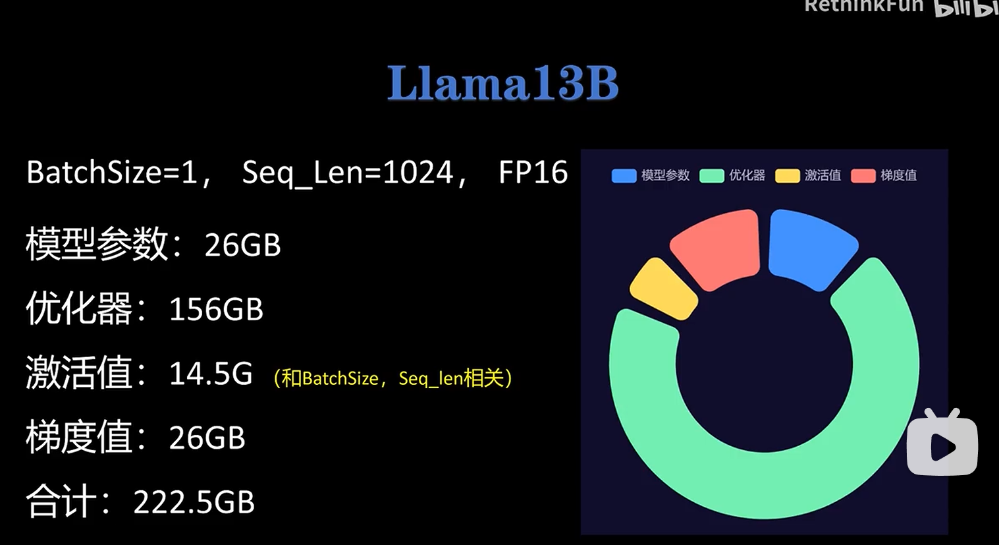

- 模型参数
- 优化器
    - Adam：梯度参数平滑值+梯度平方参数平滑值+模型参数副本（用于参数更新），都是Float32（不用float16是因为会丢失精度）
- 激活值（前向传播过程中的中间变量，因为在反向传播会用到，所以存了起来）
- 梯度值
除了激活值和batchsize以及seq_len有关，其他的都只和模型参数有关

### 优化器
[https://www.bilibili.com/video/BV1NZ421s75D]
指数加权平均：对越临近的值权重越大，且只用额外保存一个值
问题：序列小时初始的结果和真实值差别大；
解决：使用系数修正

梯度下降：梯度大的参数上容易震荡
解决（动量）：使用历史梯度的指数加权平均
RMSProp: 训练时有的梯度大，有的梯度小，也会导致训练不问题，对每个参数处于每个梯度平方的指数加权
Adam：结合了动量和RMSProp
Adam-w：增加了权重衰减（decay），每次更新参数后再减去一个很小的值，防止参数过大，提高泛化性