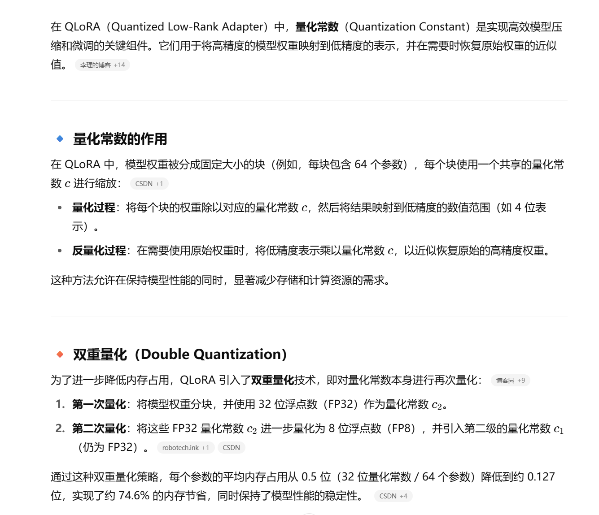

## LoRA

LoRA就是将模型中的线性层（一般是QKVO和FFN的线性层）低秩分解为两个小矩阵，假设线性层W的维度为d，那么两个小矩阵分别为A = d * r和B = r * d，然后加在原本线性层上，也就是前向传播的合成权重是W* = W + s * A * B，其中缩放超参数（LoRA scaling）s = a/r，a是缩放系数，以平衡LoRA的输出幅度

在训练时，冻结W，只训练A和B两个小矩阵，并且在初始化时初始化其中一个小矩阵参数为全0（通常为B矩阵），以保证初始时 𝐴𝐵=0，使得不改变原模型行为，并有利于稳定训练

## QLoRA

QLoRA就是在用LoRA前先对模型进行（4-bit）量化（也可二次量化，可选，二次量化就是对量化常数进行再次量化），同时提供page optimizer分页优化器，在GPU显存过高时用一部分CPU内存代替显存，解决显存不足的问题。
