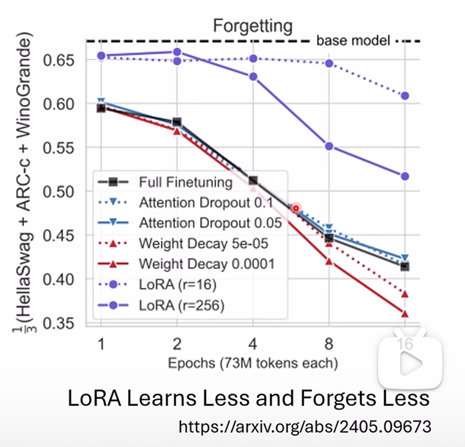
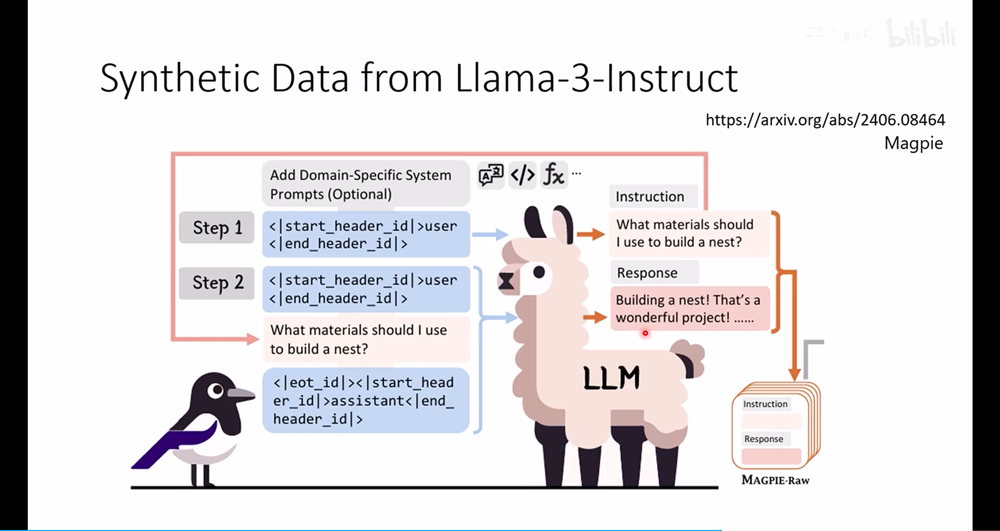
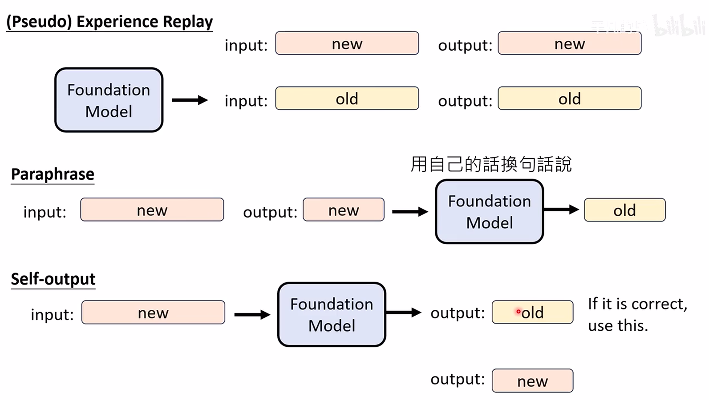
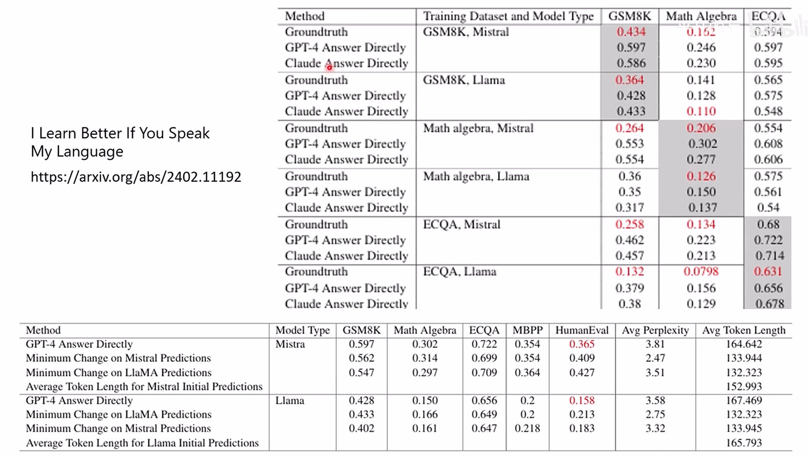
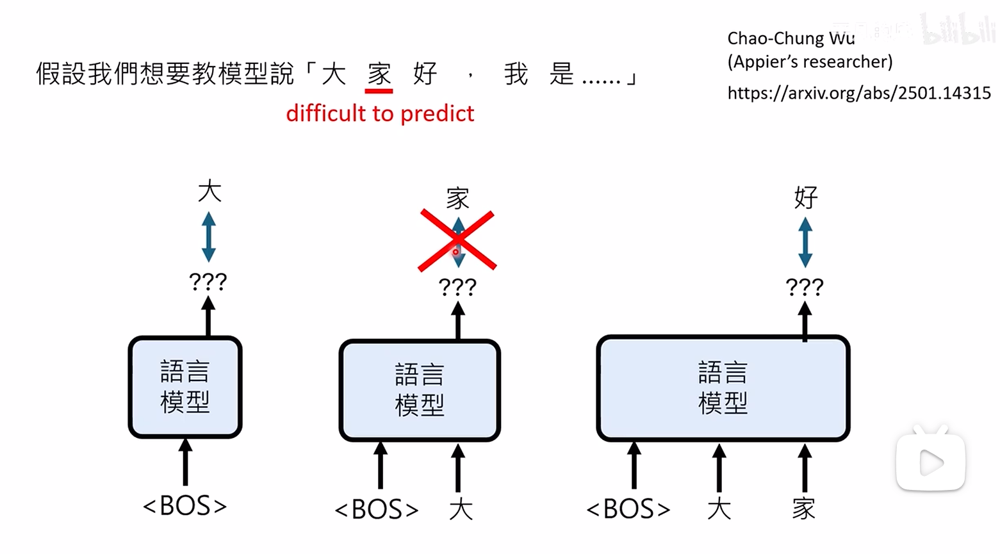
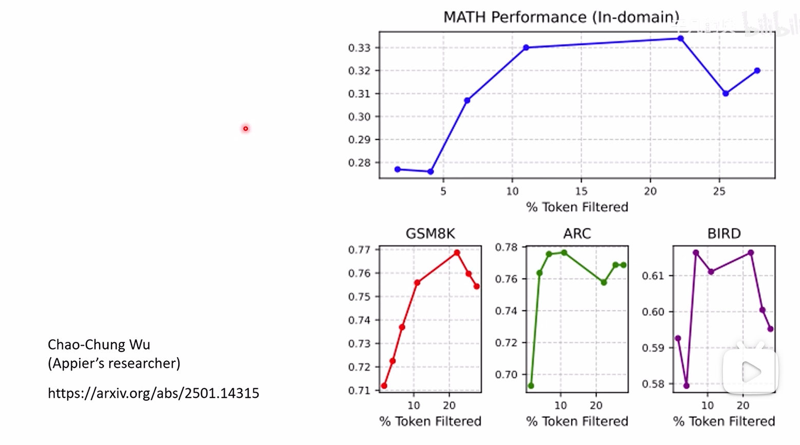

李宏毅 2025课程 [https://www.bilibili.com/video/BV1CuLczFE1p]
1. 如何解决遗忘问题？
- 给一些fundational model的训练数据给finetune阶段，大概百分之5的微调数据数量级
- 尽量用LoRA，有论文实验证明LoRA相比其他的方法遗忘程度更低

2. 如果没有fundational model的训练数据，如何解决？
- 使用self-output，也就是用fundational model生成一些语料给他，如下图就是给一个user的字段给LLama，然后他给出一个问题，之后再将这个问题又丢给llama生成答案。

- 下面代表了常用的三种方法，第一种就是直接能拿到fundational model的训练数据的；第二种是用foundational model改写人类写的答案，因为model更适应自己生成的文字；第三种是用方法评估self-output的结果是否是对的，可以采样多个答案，然后评估，选对的，这个就像强化学习那边的方法了。

- 还有论文实验证明，直接拿人写的答案去训遗忘程度更大；这个方法是用更强的模型去生成答案/用更强模型修改foundational model生成的答案，比较人写的答案

- 还有研究通过在训练过程中把难产生的token去掉，不生成他，比如图片中的给定大生成家，家是一个难生成的token，就不生成他，只训大家生成好

