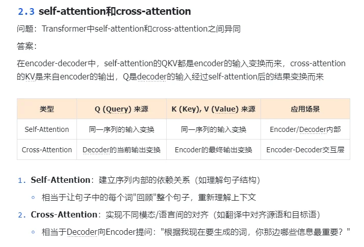
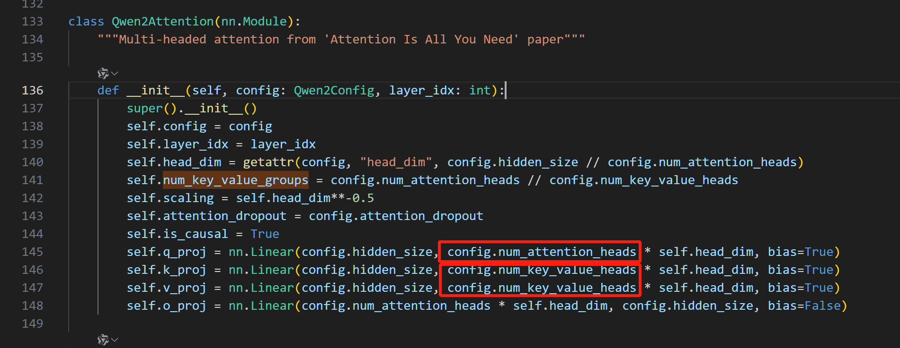
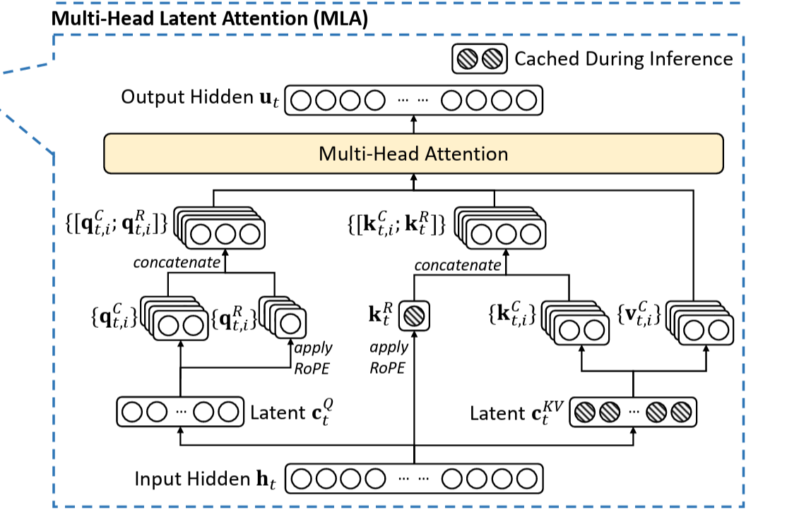

> 介绍self-attention 和 cross-attention
Self-Attention 是一种让模型能够关注输入序列中所有位置信息的机制，它计算序列中每个元素与其他所有元素的相关性。完全基于输入序列内部的关系；能够捕捉长距离依赖关系。

自注意力使得序列中每个位置既是“查询者”，也同时充当“键”和“值”的提供者，能够灵活地计算自身与同序列其他位置的相似度，以捕获长程依赖关系

cross注意力用于两条序列之间的信息交互，最常见于编码器‑解码器架构中。查询（Q）来自解码器的隐藏状态（目标序列），而键（K）与值（V）则来源于编码器的输出（源序列），使解码器能直接访问源序列的全局表示，实现跨序列的信息检索与融合

decoder-only的自回归（因果）selfattention的qkv都是由decoder的输入变换而来的。而且他的mask矩阵是下三角矩阵，因为每个位置i只能看见他之前的位置。

> 介绍多头注意力
它通过将输入表示并行拆分成多个“头”，在不同子空间各自执行注意力计算，然后将各头输出拼接并线性变换。多个头使得提升模型对不同语义关系的捕捉能力，能学习到不同的注意力模式。

> 介绍MHA, MQA, GQA, MLA
MHA就是最常见的多头注意力，每个head的q都对应各自的kv

MQA是每个head的q都只对应一个k和v。

GQA是MQA和MHA的折中，对于每若干个q组成一组，每一组对应一个k和v，被对应的这个k和v是原本这组的每个q对应的k和v求平均得来的。

- 在 MHA（Multi Head Attention） 中，每个头有自己单独的 key-value 对；标准的多头注意力机制，h个Query、Key 和 Value 矩阵。

- 在 MQA（Multi Query Attention） 中只会有一组 key-value 对；多查询注意力的一种变体，也是用于自回归解码的一种注意力机制。与MHA不同的是，MQA 让所有的头之间共享同一份 Key 和 Value 矩阵，每个头只单独保留了一份 Query 参数，从而大大减少 Key 和 Value 矩阵的参数量。

- 在 GQA（Grouped Query Attention）中，会对 attention 进行分组操作，query 被分为 N 组，每个组共享一个 Key 和 Value 矩阵GQA将查询头分成G组，每个组共享一个Key 和 Value 矩阵。GQA-G是指具有G组的grouped-query attention。GQA-1具有单个组，因此具有单个Key 和 Value，等效于MQA。而GQA-H具有与头数相等的组，等效于MHA。

在实际上，MQA和GQA种Wk和Wv的维度会比Wq小，如图

- MLA

kvcache只要存$k_t^{R}$和$c_{t}^{KV}$，也就是有位置编码的完整k和latent c

> 位置编码的作用