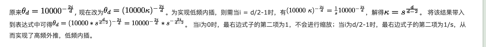
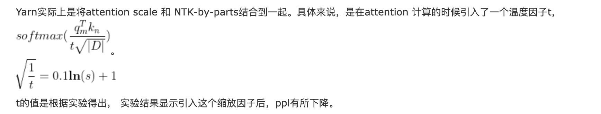

> transformer中使用的position embedding为什么是加法？

提供一个其它的视角：在高维空间中，两个随机选择的向量几乎正交；这使得Transformer能相对独立地处理token和position的信息。此外，concat会增加计算量，相比之下直接相加更直接。

正交意味着两个向量在某种度量下彼此独立，在彼此的方向上没有任何信息重叠，可以视为它们的加法不会引入冗余或无关的信息，反而是将两个独立的信息源“加起来”，得到一个新的信息组合。举例来说，比如向量a=(0,3),向量b=(4,0)，这种正交相加会保留更多原有的维度信息；而噪音通常意味着信息的丢失或干扰，通常是由于两组信息重叠或相互作用导致的。

> 长度外推 https://www.cnblogs.com/laozhanghahaha/p/18345815    从ROPE到Yarn, 一条通用公式速通长文本大模型中的位置编码：https://zhuanlan.zhihu.com/p/15311461897

1. 位置插值
- 训练时 embedding 学的是 2k 位置，推理时把 16k 的位置线性映射回 [0,2k]，避免越界。这个位置是token的位置，而非向量维度
2. NTK-aware rope
- 高频外推，低频内插，高频就是低维度的那些，为什么低维度是高频呢，可以看到xita = (10000)^(-2 \* i/d)，低维度时假设i=0，那xita就是1，根据xita的函数性质，他是个递减函数，所以i越小，xita越大，旋转越快，所以是高频
- xita = (10000)^(-2 \* i/d) => xita = (10000 \* k)^(-2*i/d) 其中k = s^(d/(d-2))，s是缩放值

3. NTK-by-parts
- 引入波长的概念（xita_i对应的圈数） = L_train \* xita / （2 \* pi）
- 圈数公式如上是因为，本身旋转矩阵的cos和sin内都是m \* xita，所以能训练的m的范围就是L_train，xita / （2 \* pi）就是单xita的圈数，所以总的就是L_train \* xita / （2 \* pi）
- 其和NTK-aware rope是类似的思路，不过高频就不外推了，只有低频内插，并且将xita重新定义如图最后

4. Dynamic NTK 
- 调整2的缩放因子s
5. yarn
- yarn = ntk-by-parts + 温度缩放，也就是在attention引入了缩放因子
