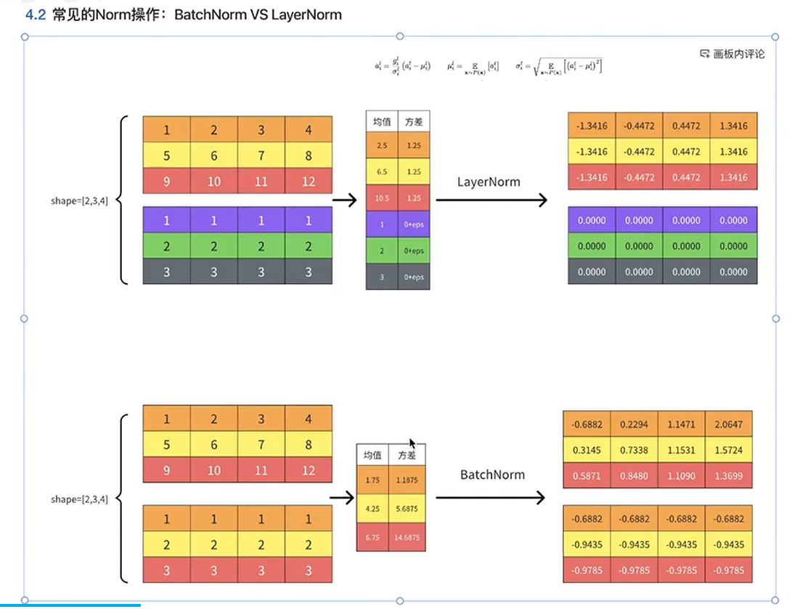
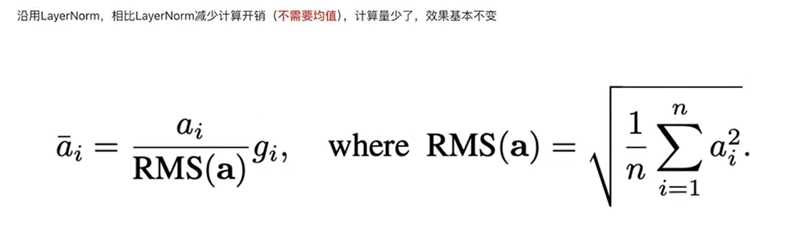

Batch Normalization（BN）和Layer Normalization（LN）是深度学习中两种核心的归一化技术，其核心差异源于归一化的维度和适用场景。以下是两者的对比分析：

Batch Normalization（BN）和Layer Normalization（LN）是深度学习中两种核心的归一化技术
- **Batch Normalization (BN)**  
  - **操作对象**：对**同一批次内的所有样本**的**同一特征维度**进行归一化。例如，在图像数据中（形状为 `(B, C, H, W)`），BN会计算每个通道（`C`）在所有样本（`B`）的空间位置（`H×W`）上的均值和方差。  
  - **几何直观**：将不同样本的同一特征“对齐”，类似于“竖切”数据，确保同一特征在不同样本间的分布稳定。

- **Layer Normalization (LN)**  
  - **操作对象**：对**单个样本的所有特征维度**进行归一化。例如，在NLP的词向量中（形状为 `(B, T, D)`），LN会计算每个样本（`B`）的所有时间步（`T`）的特征维度（`D`）的均值和方差。  
  - **几何直观**：将单个样本的所有特征“标准化”，类似于“横切”数据，确保同一序列内的特征分布稳定。

### **优缺点对比**
| **维度**         | **Batch Normalization (BN)**                          | **Layer Normalization (LN)**                          |
|------------------|------------------------------------------------------|------------------------------------------------------|
| **优点**         | 1. 显著加速CNN训练，减少内部协变量偏移； 2. 隐含正则化，提升泛化能力。 | 1. 完全独立于Batch Size，适配小批量和变长序列； 2. 稳定RNN/Transformer的梯度，避免梯度消失/爆炸。 |
| **缺点**         | 1. 依赖大Batch Size，小Batch下性能下降； 2. 不适合RNN/Transformer等序列模型。 | 1. 在CNN中效果通常不如BN； 2. 无隐含正则化，需额外正则化手段。 |

> RMSNorm

> LayerNorm 和 RMSNorm的主要差别在于前者的所有x有减去均值，后者没有，使得后者计算更简单，数值稳定性略高。他们都是单样本特征归一化，BN是跨样本归一化