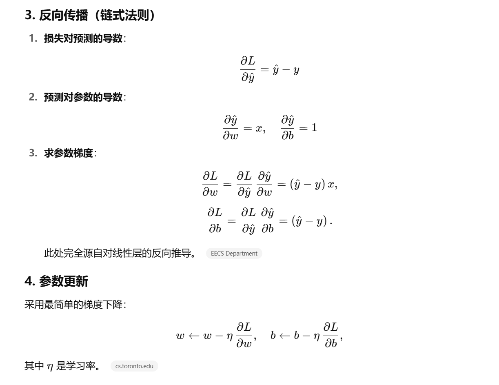

> 怎么解决过拟合问题
过拟合指的是模型在训练集上表现优秀，但在测试集或新数据上表现较差，无法很好地泛化。
过拟合通常源于模型过于复杂或数据不足。
解决方法：
1. 增加训练数据，更多的数据能帮助模型学习数据的真实分布，减少对噪声或局部特征的依赖
2. Dropout，训练时随机“关闭”一部分神经元
3. 降低模型复杂度，避免过度拟合训练数据中的噪声
4. 正则化，在损失函数中加入惩罚项，限制参数值过大，从而降低模型复杂度
5. LoRA 通过低秩分解（Low-Rank Decomposition）来更新权重矩阵，仅训练少量参数（如低秩矩阵），而非全参数微调，从而降低模型复杂度，减少过拟合风险（同3）

> 反向传播过程

前向传播完后，得到模型的输出，然后通过与label对比计算得到loss，接着对损失求导并通过链式法则（chain rule）计算各层的参数梯度，最后用这些梯度更新参数，然后根据模型参数梯度更新模型参数。

