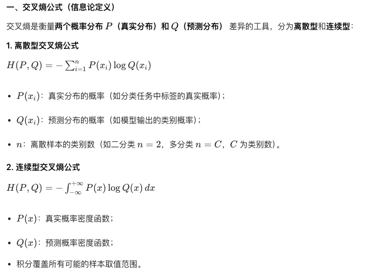
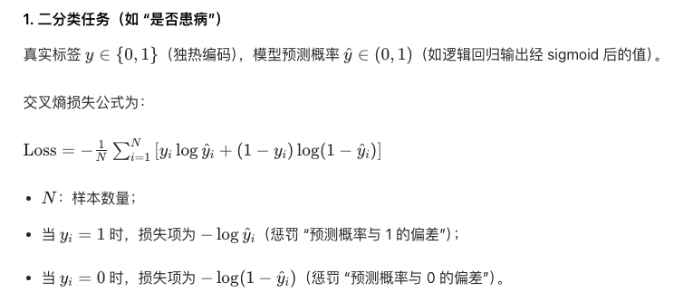
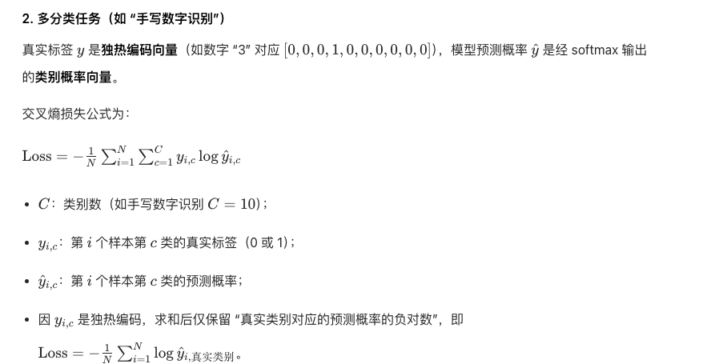

#### 介绍下最大似然估计
#### 分类问题常用的损失函数

#### 交叉熵公式
交叉熵 = -求和p * log(q)；p是真实分布，q是预测分布
#### KL散度和交叉熵的区别
交叉熵是kl散度的组成部分，交叉熵为H(p,q) = -求和p * log(q)，kl散度=交叉熵H(p,q) - 真实分布的熵H(p,p)
#### 介绍KL散度怎么计算的
交叉熵 = H(p,q) = -求和p * log(q)
kl散度 = H(p,q) - H(p,p)
#### AUC的定义
#### 介绍逻辑回归、knn。
	
#### 梯度下降介绍一下
梯度下降是一种迭代优化算法，核心是沿着损失函数的梯度反方向更新参数，逐步逼近最小损失值对应的最优参数。
- 梯度是函数在某点的变化率向量，指向函数值增长最快的方向。
- 梯度反方向就是函数值下降最快的方向，算法沿这个方向调整参数，能高效逼近最优解。
- 用学习率控制每次参数更新的步长，平衡收敛速度和迭代稳定性。

#### 介绍一下深度学习反向传播的过程
1. 前向传播：计算输出与损失
2. 输出层梯度计算
3. 隐藏层梯度反向传递:利用链式法则，将输出层的梯度反向传递到前一层隐藏层。每层只需要用到后一层的梯度，就能计算当前层参数的梯度，避免重复计算。
4. 用计算好的梯度，结合学习率，通过梯度下降法调整所有层的参数。(AdamW优化器。。)
#### AdamW原理，对比SGD的区别
一阶矩（动量） + 二阶矩（学习率自动调整） + 权重衰减
sgd：全局固定学习率，需手动调整或配合学习率调度（如余弦退火、Step Decay）。若学习率设置不当，可能陷入局部最优或震荡。
#### AdamW和Adam的区别和改进
权重衰减直接作用于参数更新，与梯度无关，等价于显式正则化。
将权重衰减从梯度更新中解藕，以免像adam那样让自适应学习率影响了权重衰减；解藕使得模型训练更不容易过拟合；权重衰减就像l2正则，adam的自适应学习率使得权重衰减越来越小，导致过拟合

#### 如何解决梯度消失、梯度爆炸
梯度消失解决核心：过的层越多，梯度越消失，所以直接传播有助于梯度传递
1. 引入残差连接
2. 更少层数
3. 使用自适应优化器，避免梯度过大/过小导致梯度爆炸/消失
4. 门控机制，减少梯度传播，防止无效梯度积累
5. 降低学习率，可使用退火
6. 使用归一化（层归一化/batchnorm）
#### 如何判断过拟合、欠拟合，如何解决？
- 欠拟合：
训练集和验证集性能都差（如准确率低、loss 高）。

核心问题：模型结构简单，特征维度不够

解决方法：提升模型能力（加复杂）
- 过拟合：训练集性能极好（loss 低、准确率高），但验证集性能显著下降（差距大）

核心问题：数据量少、模型复杂度过高（如深层网络 + 少量数据）、未做正则化。
#### 深拷贝浅拷贝的区别
#### minHash、SimHash的计算过程
#### 残差连接的作用
1. 解决深层网络的梯度消失（最关键）
2. 实现跨层融合，让模型充分复用信息
3. 加速训练收敛
#### 树和图的根本区别
#### 数组和链表的区别
#### 介绍常见的排序算法以及他们的时间复杂度、空间复杂度、是否稳定

#### 梯度怎么算
1. 定义损失函数（如 MSE、交叉熵）；
2. 前向传播：计算模型输出和损失，框架记录计算图
3. 反向传播：调用框架的自动求导接口，通过链式法则从输出层反向计算所有参数的梯度；
4. 梯度更新：用梯度下降（或 AdamW 等优化器）更新参数$$\theta = \theta - \eta \cdot \nabla L$$