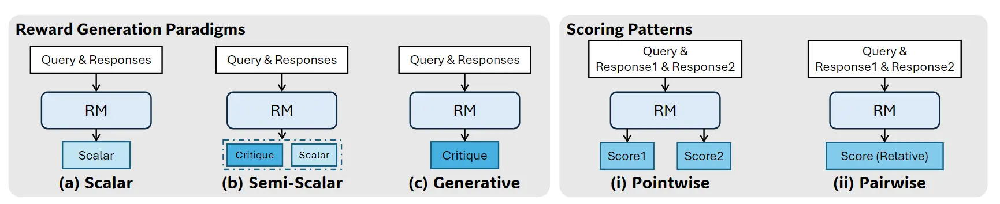
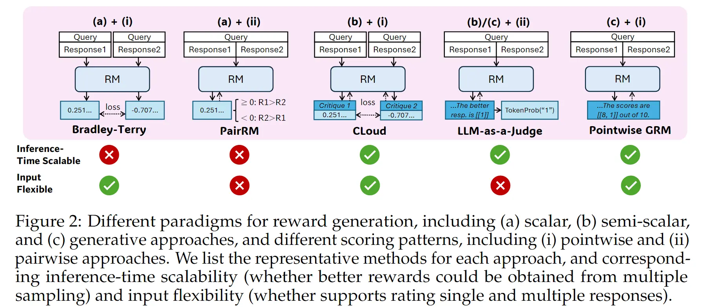
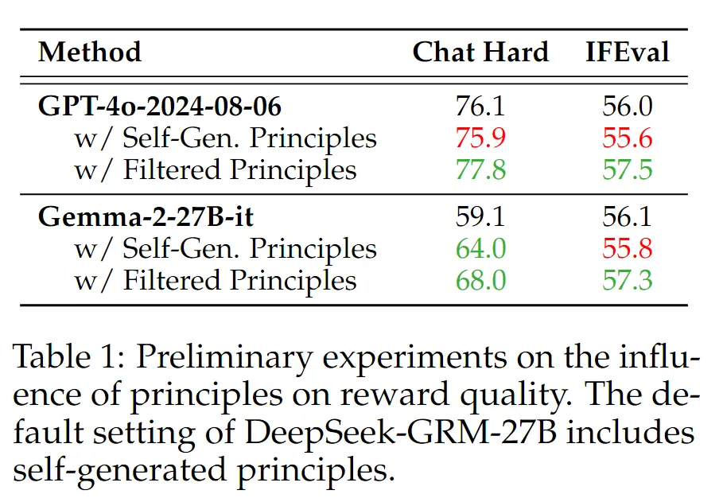
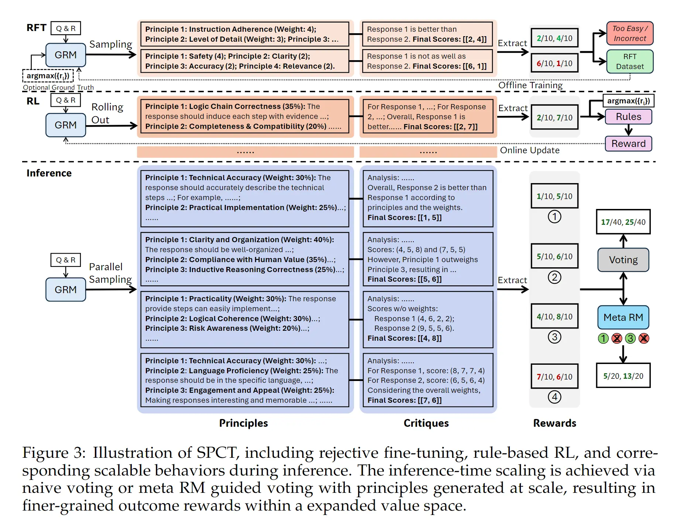

# DeepSeek-GRM：Inferene-time Scaling 的 Generalist Reward Model(通用奖励模型)
- 原文：https://bruceyuan.com/post/deepseek-grm-paper-reading-notes.html
- Inferene-time Scaling: 大概就是采样多样性的差不多说法

## 前言
Training Scaling 和 Inference Scaling 在 Base-Model 都取得了巨大的成功。那么在强化学习（Reinforcement Learning, RL）过程中需要的 Reward-Model（RM） 是不是也可以通过 Inference-Time Scaling 来优化 RM 呢？因此 DeepSeek 团队提出一种方法叫做：Self-Principed Critique Tuning (SPCT) 的方法来训练一个通用型的 RM（Generalist RM）。

RL 在推理模型中取得了巨大的成功，如 OpenAI 的 O系列、DeepSeek R系列（DeepSeek-R1），但这些模型都采用了 Rule-Base Reward Model，因此 Reward Model 具有一定的局限性，在很多场景不够通用，因此本文的 DeepSeek-GRM 是旨在利用 SPCT 的方式来训练一个通用型的 Reward Model，并且能够很好得 Inference-Time Scale，以此得到一个在通用任务（非数学、代码等有精确 Reward）也能有很好效果的模型。

## 相关工作

### RM模型训练分类

Critique就是思维链。

（a）Scalar：让模型一个 Head 数出一个浮点数

（b）Semi-Scalar：先让模型一个 Head 输出一段分析（Critique），然后再用另外一个 Head 输出一个浮点数（或者直接计算某 token的 logit 值）

（c）Generative：模型只有一个 Head，这个 Head 是通过生成的方式输出 Critique 以及最终的分数，最终的分数要自己抽取出来。

（i）Pointwise，输入是一条样本（或多个样本），但是要对每一个样本都输出对应的分数。

（ii）Pairwise，输入要是成对的样本，输入是一个值。假设是两个样本 a, b，那么输出是一个值，大于0 表示 a 好，小于0表示 b好；或者直接输出 a / b 来表示 a 好还是 b 好。

**最终排列组合**

实验证明，（c）+（i）效果比（b）+（i）好

- (b) + (i)，这里因为有 Critique 的存在，每次采样都会有不同的结果，所以可以 Scaling。（生成cot和分数的head不是同一个）
- (c) + (i)，通过生成的方式生成【critique 和 每个样本的 Score】，然后自行解析抽取结果。（生成cot和分数的head（作为一个模型整体）是同一个）

### Principle可以提升RM效果

前面提到过，部分领域可以有精确的规则，比如数学、代码，但是针对于一些通用的领域，比如角色扮演、写作等，评判的规则就会变得更复杂、并且通常都没有一个固定的标准答案（golden truth），因此我们可以指定一些准则（principles）来进行打分。

这些准则的获取方法有两种：
- 人为定好准则给模型打分
- 模型在生成评分时自己生成准则，然后根据自己生成的准则来评分

这里使用第二种。下面解释一下这个表格，以 GPT4o-2024-0806为例，Gemma-2-27B-it 同理，从表格的数据可以看出，**过滤为王**：

## Self-Principled Critique Tuning(SPCT)

从这个图可以看出，SPCT 一共包含两个大部分部分

- 训练
    - RFT（rejective fine-tuning）作为冷启动
    - rule-based online RL（reinforcement learning） 用于强化模型生成评估准则（principle）和推理批判（critique/cot）的能力，后面都用 principle 和 critique 表示。
- 推理
    - 通过 inference-time scaling 的方式增加 RM 的最终能力。

### RFT (Reject fine-tuning)
通过拒绝采样采样包含推理分析和答案的response，并通过将答案和标签比对进行过滤，同时去掉简单的样例（给分全对）得到数据集；如果采样1的样例全都不符合标签，那就将人工打分的最高的那条样例拿来采样得到一个分数。

### online RL
rule-based reward，预测对了拿一分，错了负一分。

## 推理

SPCT 最重要的初衷是什么？是【inference-time scaling】。因此推理的时候有两个方式来 Scaling 达到提升效果的目的。

- Voting with Generated Rewards。具体解释为：推理的时候 sample 多条结果，那么就会有多个结果的 score，把每个 response 的结果加起来作为最终的结果。

（大模型的投票策略（Voting Strategy）是指在使用大型语言模型（LLM）进行推理或生成内容时，**不只**生成一个结果，而是通过某种方式获得多个可能的输出，然后运用一种聚合或选择机制，从这些候选中“投票”**选出**或**整合**成最终的最佳结果。）

- Meta Reward Model Guided Voting。**（过滤）**也就是说不是对多次采样的 Score 直接加起来，因为有时候 GRM 可能生成一些质量低的principle 和 critique，而是通过训练一个 meta rewrd model 来引导投票过程。具体就是训练一个二分类，表示当前的 principle 和 critique 是否要被用于投票，也就是过滤掉一些低质量的采样结果。比如 Figure 3 中的 meta RM 就过滤掉了 2 4 两个结果，只用 1 3 用于投票。一般设置保留一半的采样结果。